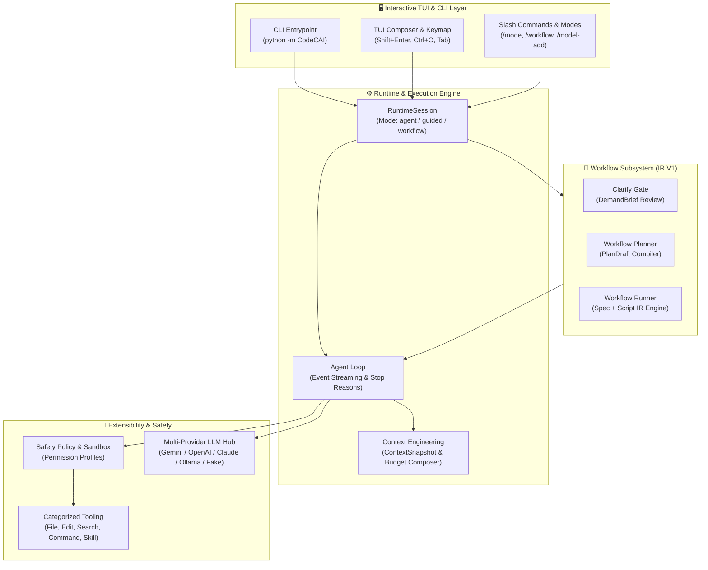

# CodeCAI

<p align="center">
  <strong>面向个人开发工作流的现代化 CLI Coding Agent 原型与可审计 Workflow Runtime</strong>
</p>

<p align="center">
  <a href="https://github.com/CAI5946/CodeCAI/actions/workflows/tests.yml"></a>
  
  
  
  <a href="LICENSE"></a>
</p>

---

## 📖 项目概览

**CodeCAI** 是一个探索下一代 AI 编程交互的 CLI Coding Agent 原型系统。它不仅具备单 Agent 的“理解需求 -> 搜索上下文 -> 工具调用 -> 代码修改 -> 自动验证”闭环能力，更专注于解决复杂编码任务中的**确定性控制、需求澄清门禁、安全沙箱机制与可恢复 Workflow 编排**。

### 🌟 核心价值与设计哲学

* **确定性与可控性并重**：摒弃不可控的黑盒自由调用，引入结构化受限 IR（`WorkflowSpec + WorkflowScript`），实现流程可审计、可断点与可重试。
* **渐进式交互与需求门禁**：内置 `Clarify Gate` 与 `DemandBrief` 合同机制，在复杂任务执行前主动识别歧义，避免误改代码。
* **工程化与免依赖体验**：默认集成确定性 `Fake Adapter`，**无需任何 API Key 即可本地秒级启动交互、运行全量单元测试与基准评测**。

---

## ✨ 核心特性

| 特性模块 | 核心能力描述 |
| :--- | :--- |
| 🔄 **Workflow Runtime** | 基于结构化受限 IR 的工作流引擎，支持 `run_phase`、`branch`、`retry`、`handoff` 等控制面调度与状态持久化。 |
| 🛡️ **安全沙箱与权限管理** | 内置前置 `SafetyPolicy` 检查，支持 `read-only`、`ask-approval`、`approve-safe`、`full-access` 细粒度权限策略。 |
| 🔌 **多 Provider 动态发现** | 支持 Google Gemini、OpenAI、Anthropic、DeepSeek、GLM、Ollama 及本地 Fake Adapter，支持运行时动态配置与零停机切换。 |
| 🧠 **Context Engineering** | 结构化 `ContextSnapshot` 上下文管道，支持 Token 预算控制、文件依赖追踪与敏捷上下文裁剪。 |
| ⚡ **现代化 CLI / TUI** | 支持 Slash Command、多行输入（Shift+Enter）、`Ctrl+O` 任务实时过程折叠/展开、交互式 Clarify 选择题弹窗与 `!` Shell 模式。 |
| 🧪 **Micro-Benchmark 评估体系** | 自带隔离 Workspace 的小型代码任务自动化评估基准（Harness），数据驱动衡量 Agent 的解决成功率与回归表现。 |

---

## 🏗️ 架构全景



---

## 🚀 快速上手

### 1. 安装依赖

```powershell
python -m pip install -r CodeCAI\requirements.txt
```

### 2. 启动交互式 Runtime（默认无需 API Key）

项目内置确定性 `fake/fake` 模型，无需配置环境变量即可直接启动并体验所有 CLI 交互：

```powershell
python -m CodeCAI
```

*也可以运行一次性测试任务：*
```powershell
python -m CodeCAI --task "Read README"
```

### 3. 配置真实 LLM Provider（可选）

CodeCAI 支持在运行中使用交互式命令配置模型：

```text
/model-add     # 选择 Provider、输入 API Key 并动态拉取模型列表
/model         # 切换已配置的模型 Profile
/model-test    # 对当前模型进行连通性 Smoke Check
```

> **安全说明**：所有 API Key 均安全保存在本地 `.env` 中，模型配置写入 `.codecai/models.json`，两者默认被 `.gitignore` 忽略，严格防止凭证泄露。

---

## 💡 交互模式与核心指令

CodeCAI 提供三种灵活的执行模式（通过 `Shift+Tab` 或 `/mode` 自由切换）：

* 🤖 **Agent Mode（默认）**：普通任务直接进入 Agent Loop，进行自主工具调用与推理。
* 📋 **Guided Mode**：普通任务先进入 **Clarify Gate**，LLM 结合仓库上下文提出澄清问题，生成结构化 `DemandBrief` 合同，经由弹窗确认后再执行。
* 🔄 **Workflow Mode**：任务自动交由 Workflow Planner 编译为串行 `WorkflowPlan`（如 `inspect -> handoff`），支持阶段化状态汇报。

### 常用快捷键与 Slash Commands

| 指令 / 快捷键 | 功能说明 |
| :--- | :--- |
| `/mode [agent\|guided\|workflow]` | 切换当前运行模式（支持 `Shift+Tab` 循环快捷切换） |
| `/workflow <TASK>` | 显式启动工作流：澄清需求 -> 编译 Plan -> 执行并交付最终成果 |
| `/permission <profile>` | 调整权限等级：`read-only` / `ask-approval` / `approve-safe` / `full-access` |
| `Ctrl+O` 或 `/process` | 展开或折叠最近一次任务的实时执行过程与工具调用细节 |
| `Shift+Enter` / `Ctrl+J` | 在多行输入框中插入换行 |
| `$skill <name> <args>` | 显式调用本地扩展 Skill（注入对应 `SKILL.md` 指令与能力） |
| `!<command>` | 直接执行宿主环境 Shell 命令，并结构化捕获输出 |
| `/keymap` | 打开键盘快捷键速查面板 |

---

## 🧠 技术亮点与核心设计决策

针对 AI Coding Agent 在工程落地中的常见挑战，CodeCAI 沉淀了以下关键技术决策：

| 关键技术方向 | 核心挑战 | CodeCAI 的设计决策与工程实现 |
| :--- | :--- | :--- |
| **Workflow 编排** | 通用图引擎过度复杂，自由 Agent 易发散 | 确立 **`WorkflowSpec + WorkflowScript`** 双层 IR 设计：Spec 负责外部输入输出与合同审计，Script 作为受限指令集仅表达控制面操作（`run_phase` / `branch` / `handoff`），绝不下沉到工具级。 |
| **需求澄清与一致性** | 自然语言歧义导致盲目修改代码 | 独立设计 **Clarify Gate** 与 **`DemandBrief`**。模型利用只读工具调研代码库后生成结构化选项提问，将不确定需求固化为可审查的交付合同。 |
| **工具安全与沙箱** | 大模型执行破坏性命令风险 | 实现 **`SafetyPolicy`** 前置拦截与分类授权。区分只读工具、安全变更与高危 Shell 执行，默认开启 `approve-safe` 最小必要权限。 |
| **Context 管理** | 长上下文导致 Token 爆炸与注意涣散 | 构建 **`ContextSnapshot`** 与 **`ContextComposer`**。根据任务类型实现分层上下文加载、静态/动态规则隔离与预算裁剪。 |
| **多模型适配与扩展** | 厂商 API 格式各异，单点绑定风险 | 建立统一的 **Provider Adapter** 抽象门面与动态模型发现能力（Discovery），实现 Google、OpenAI、Anthropic、Ollama 无缝热拔插。 |

---

## 🧪 工程质量与自动化验证

CodeCAI 遵循严格的工程化开发规范与自动化测试保障：

* **全量单元测试**：
  ```powershell
  python -m unittest discover tests
  ```
  *包含 330+ 个自动化测试用例，覆盖 Workflow IR、Clarify 状态机、TUI 交互渲染、Safety 策略与 Context 管道。*
* **跨平台 CI 矩阵**：GitHub Actions 在 **Python 3.10、3.11、3.12、3.13** 环境下持续自动化验证。
* **本地 Micro-Benchmark 评测**：
  ```powershell
  python -m benchmarks.runner --task all --timeout 30
  ```
  *基于真实代码任务评估 Agent 的工具调度、文件读写及回归通过率。*

---

## 📚 文档索引

深入阅读 CodeCAI 的架构与详细技术演进：

* 📋 [开发状态与最新验证 (docs/status.md)](docs/status.md)
* 🗺️ [长期产品路线图 (docs/roadmap.md)](docs/roadmap.md)
* 🔄 [Workflow 架构设计 (docs/features/Workflow.md)](docs/features/Workflow.md)
* 🧠 [Context Engineering 规范 (docs/features/Context Engineering.md)](docs/features/Context%20Engineering.md)
* 🛠️ [工具系统架构 (docs/features/Tools.md)](docs/features/Tools.md)
* 🔌 [多 Provider 适配体系 (docs/features/LLM Providers.md)](docs/features/LLM%20Providers.md)
* 🎓 [学习型开发模式 (docs/learning-mode.md)](docs/learning-mode.md)

---

## 📄 开源协议与贡献

* **许可证**：本项目采用 [MIT License](LICENSE) 开源。
* **贡献指南**：请参阅 [CONTRIBUTING.md](CONTRIBUTING.md)。
* **安全报告**：请参阅 [SECURITY.md](SECURITY.md)。
